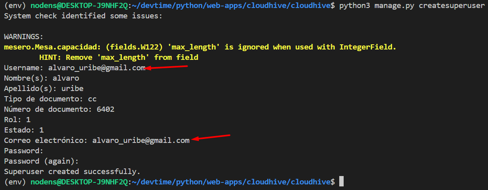

#### ¿cómo correr el proyecto en mi computadora?  

Hay una guía paso a paso para ejecutar el proyecto en producción utilizando Docker **(pag 1-7)**, y otra para para ejecutarlo en un servidor local **(pag 7-10)**.  

[manual to exec .pdf](https://uniminuto0-my.sharepoint.com/:b:/g/personal/juan_suarez-so_uniminuto_edu_co/Ee8j0Xh8C5lCs7LQtARElOABI0mAyYcN4HmdPV78EH61UQ?e=PYaiwV)  

#### ¿cómo ejecutar el proyecto?  

Debe crear un super usuario para entrar al módulo del administrador con el comando: `py manage.py createsuperuser` para acceder al módulo del administrador.  

#### otros:  

debe ejecutar el comando: `docker-compose exec django-web python manage.py migrate` para activar todos los servicios de django.

